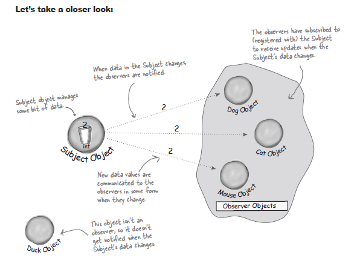
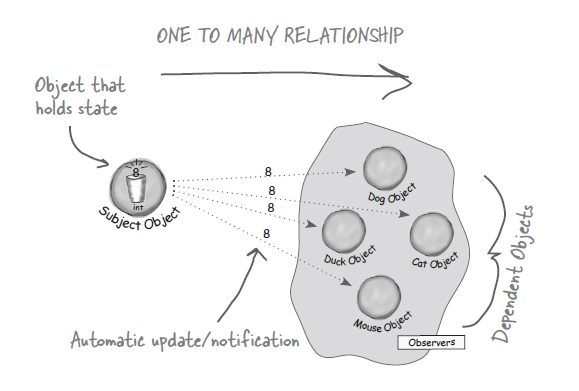
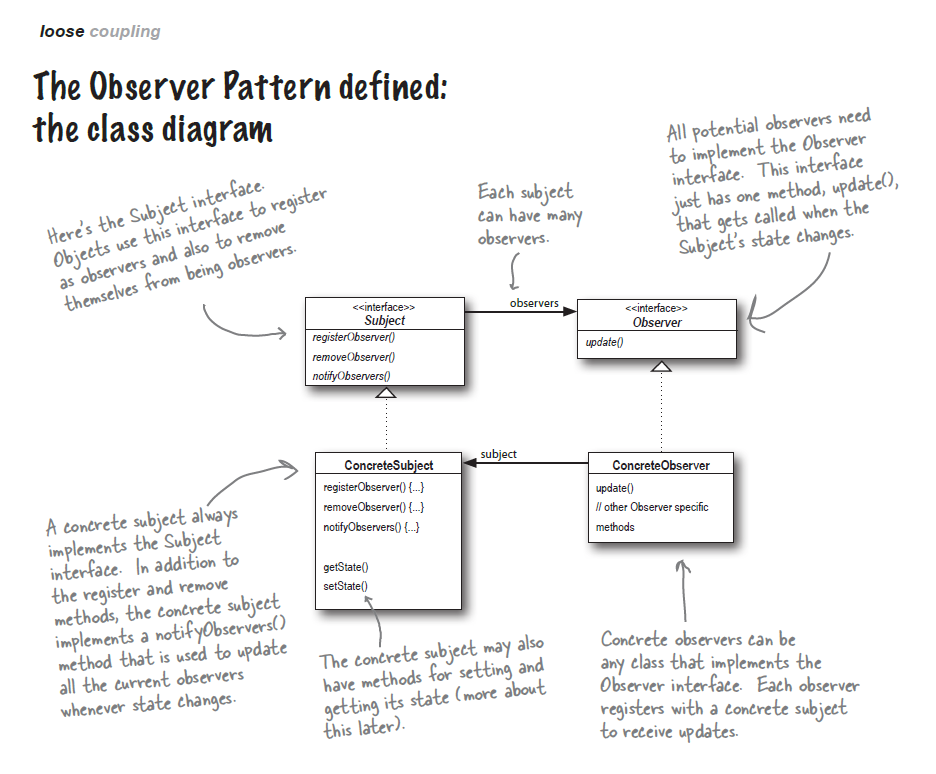
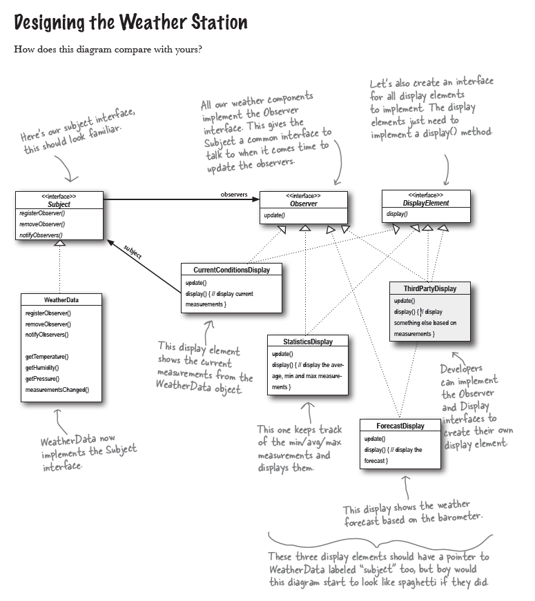

## 2. 옵저버 패턴

[요구사항]

Weather-I-Rama사의 차세대 인터넷 기반 기상 정보 스테이션 구축 프로젝트


기상 모니터링 애플리케이션 개요<br/>
이 시스템은 실제 기상 정보를 수집하는 장비로 습도 센서, 온도 센서, 압력 센서의 값을 수집하고, 기상 스테이션으로 부터 오는 결과(기상 정보 수집 결과)로부터 오는 데이터를 사용자에게 현재 기상 정보를 보여준다. 또한, WeatherData 객체를 사용하여 현재 조건, 기상 통계, 기상 예측 항목을 갱신해 가면서 보여주어야 한다.

최신 측정치 수집 시 실시간으로 갱신 가능해야 하고, 확장 가능해야 한다.


[요구사항 분석]

1. `WeatherData` 클래스에는 세 가지 측정값(온도, 습도, 기압)을 알아내기 위한 게터 메서드가 존재
2. 새로운 기상 측정 데이터가 나올 떄마다 `measurementsChanged` 메서드가 호출된다.
3. 기상 데이터를 사용하는 세 개의 디스플레이 항목을 구현해야 한다.<br/>
3-1. 하나, 현재 조건을 표시<br/>
3-2. 둘, 기상 통계를 표시<br/>
3-3. 셋, WeatherData에서 새로운 측정값이 들어올 때마다 디스플레이 갱신
4. 시스템이 확장 가능해야 한다. 다른 개발자들이 별도의 디스플레이 항목을 만들 수 있어야 하고, 사용자들이 애플리케이션에 마음대로 디스플레이 항목을 추가/제거 할 수 있어야 한다.<br/>
기본 값은 세 가지 기본 디스플레이 형식을 제공한다.


---

일단 옵저버 패턴을 공부하고나서 기상 모니터링 애플리케이션에 어떻게 적용할 수 있는지 알아보도록 한다.

ex. <br/>
Q.신문이나 잡지는 어떻게 구독하는가?<br/>
A-1. 신문사가 사업을 시작하고 신문을 찍어낸다.<br/>
A-2. 독자가 특정 신문사/잡지사에 구독 신청을 하면 매번 새로운 신문/잡지가 나올 때마다 배달을 받는다. 계속 구독자로 남아있다면 계속해서 신문/잡지를 받는다.<br/>
A-3. 신문을 더 이상 보고 싶지 않으면 구독 해지 신청을 하게 되고 그러면 더 이상 신문이 오지 않는다.<br/>
A-4. 신문사가 계속 영업을 하는 이상 여러 개인 독자, 호텔, 항공사 및 기타 회사 등에서 꾸준히 구독 및 해지를 하게 된다.

**출판사(subject) + 구독자(observer) = 옵저버 패턴**



- 출판사 객체에서 일부 데이터를 관리한다.<br/>
- 출판사 객체의 데이터가 달라지면 구독자한테 그 소식이 전해진다.<br/>
- 데이터가 바뀌면 새로운 데이터값이 어떤 방법으로든 구독자들에게 전달된다.<br/>
- 구독자 객체들은 출판사 객체를 구독(출판사 객체에 등록되어 있음을 의미)하고 있으며 출판사의 데이터가 바뀌면 갱신 내용을 전달받는다.<br/>
- 만약 구독자가 아닌 경우라면 출판사 객체의 데이터가 바뀌어도 아무런 연락을 받지 못한다.


### 옵저버 패턴의 정의
옵저버 패턴(Observer Pattern)에서는 한 객체의 상태가 바뀌면 그 객체에 의존하는 다른 객체들한테 연락이 가고 자동으로 내용이 갱신되는 방식으로 일대다(one-to-many) 의존성을 정의한다.



일대다 관계는 주제 객체와 옵저버에 의해 정의되게 되는데, 옵저버는 주제에 의존하게 된다.

주제의 상태가 바뀌면 옵저버한테 연락이 가고, 방법에 따라 옵저버에 있는 값이 전달받은 새로운 값으로 갱신될 수도 있다.

옵저버 패턴을 구현하는 방법에는 여러 가지가 있지만, 대부분 주제(Subject) 인터페이스와 옵저버(Observer) 인터페이스가 들어있는 클래스 디자인을 바탕으로 한다.




```
- Subject
객체에서 옵저버로 등록하거나 옵저버 목록에서 탈퇴하고 싶을 때 이 인터페이스의 메서드를 사용한다.

- ConcreteSubject
Subject 역할을 하는 구상 클래스에서는 항상 Subject 인터페이스를 구현해야 한다.
Subject 클래스에서는 등록 및 해지를 위한 메서드 외에 상태가 바뀔 때마다 모든 옵저버들에게 연락을 하기 위한 notifyObserver 메서드도 구현해야 한다.

getState와 setState는 Subject 클래의 상태를 알아내고 설정하는 메서드이다.

=========

- Observer
옵저버가 될 가능성이 있는 객체에서는 반드시 Observer 인터페이스를 구현해야 한다. 이 인터페이스에는 Subject의 상태가 바뀌었을 때 호출되는 update 메서드를 가진다.

- ConcreteObserver
Observer 인터페이스를 구현한다면 무엇이든 옵저버 클래스가 될 수 있다.
각 옵저버는 특정 주제 객체에 등록을 해서 연락 받을 수 있다.
``` 

### 느슨한 결합(Loose Coupling)의 위력

두 객체가 느슨하게 결합되어 있다는 것은, 그 둘이 상호작용을 하긴 하지만 서로에 대해 서로 잘 모른다는 것을 의미한다.

옵저버 패턴에서는 주제와 옵저버가 느슨하게 결합되어 있는 객체 디자인을 제공한다. 왜 그럴까?
```
주제가 옵저버에 대해서 아는 것은 옵저버가 특정 인터페이스(Observer 인터페이스)를 구현한다는 것 뿐이다.
옵저버는 언제든지 새로 추가할 수 있다.
새로운 형식의 옵저버를 추가하려고 할 때도 주제를 전혀 변경할 필요가 없다.
주제와 옵저버는 서로 독립적으로 재사용할 수 있다.
주제나 옵저버가 바뀌더라도 서로한테 영향을 미치지는 않는다.
```

> 디자인 원칙
> 서로 상호작용을 하는 객체 사이에서는 가능하면 느슨하게 결합하는 디자인을 사용해야 한다.

느슨하게 결합하는 디자인을 사용하면 변경 사항이 생겨도 무난히 처리할 수 있는 유연한 객체지향 시스템을 구축할 수 있다.
객체 사이의 상호 의존성을 최소화할 수 있기 때문이다.

옵저버 패턴을 적용하여 다이어그램을 그리면 다음과 같을 것이다.

