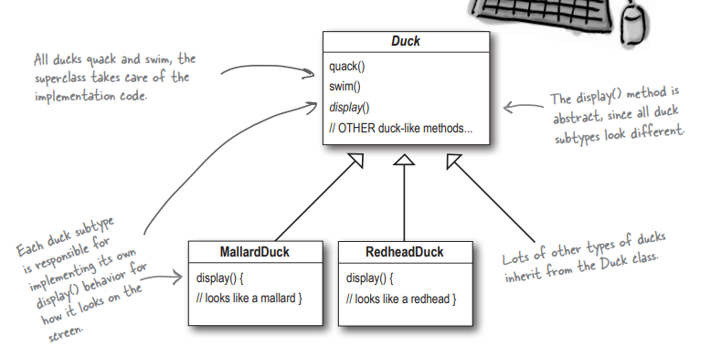
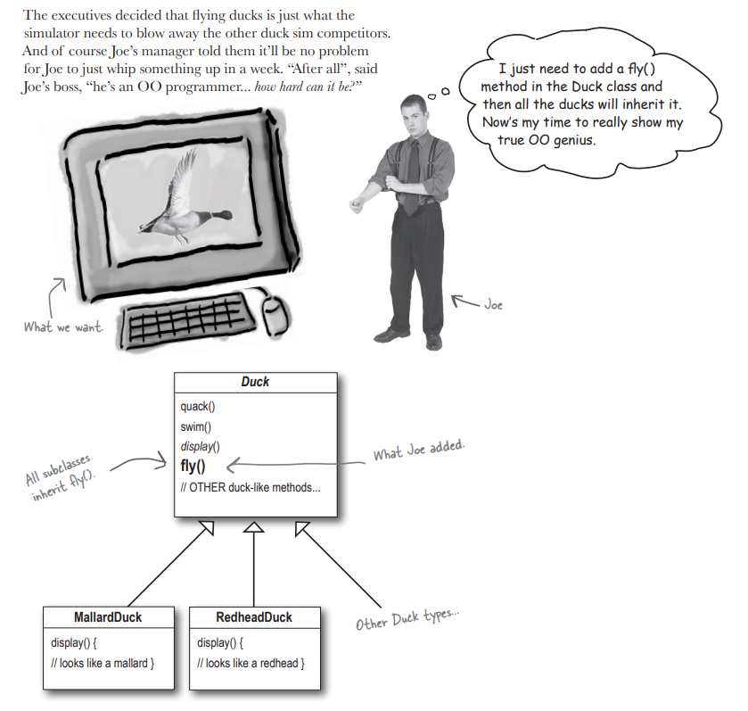
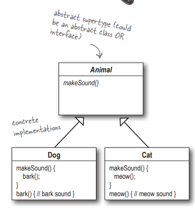

## 1. 디자인 패턴 소개

조(Joe)는 SimUDuck이라는 성공적인 요리 연못 시뮬레이션 게임을 만드는 회사에 다니고 있다. 이 게임에서는 헤엄도 치고 꽥꽥거리는 소리도 내는 매우 다양한 오리 종류를 보여줄 수 있다.

이 시스템을 처음으로 디자인한 사람들은 Duck이라는 수퍼클래스를 만든 다음, 그 클래스를 확장하여 다른 모든 종류의 오리를 만들었다.



그런데, 오리들이 날아다닐 수 있도록 해야 한다는 새로운 요구사항이 추가돼서 조(Joe)는 Duck 클래스에 fly()메서드만 추가하면 모든 오리들이 상속 받아서 구현하면 된다고 생각했다.



그러나 고무로 된 오리 인형은 동물도 아닌 것이 날아다니는 불상사가 일어나게 되었다. <br/>
즉, 코드의 한 부분만을 바꿈으로 해서 프로그램 전체에 부작용(날아다니는 고무 오리)이 발생하게 되었다.

인터페이스를 사용해도 코드 중복이 발생하기 때문에 올바른 해결책이 아니다. **그렇기에 상속을 사용하는 것이 그리 성공적이지 못하다는 것을 알 수 있다.**

하지만 바로 이상황에서 딱 어울릴 만한 디자인 원칙이 있다.

> 디자인 원칙 1<br/>
> 애플리케이션에서 달라지는 부분을 찾아내고, 달라지지 않는 부분으로부터 분리 시킨다.

fly와 quack은 Duck 클래스에서 오리마다 달라지는 부분이다.<br/>
이러한 행동을 Duck 클래스로부터 갈라내기 위해서 그 두 메서드를 모두 Duck 클래스로부터 끄집어내서 각 행동을 나타낼 클래스 집합을 새로 만들어야 한다.

> 디자인 원칙2 <br/>
> 구현이 아닌 인터페이스에 맞춰서 프로그래밍한다.

이 말은 뜻은, Animal이라는 추상 클래스가 있고, 그 밑에 Dog와 Cat이라는 구현 클래스가 있다고 가정했을 때 구현에 맞춰 프로그래밍한다면 다음과 같이 할 수 있다.
```java
Dog d = new Dog();
d.bark();
```

하지만 인터페이스/상위 형식에 맞춰서 프로그래밍한다면 다음과 같이 할 수 있다.
```java
Animal animal = new Dog();
animal.makeSound();
```



더 바람직한 방법은 상위 형식의 인스턴스를 만드는 과정을 (new Dog() 같은 식으로) 직접 코드로 만드는 대신 구체적으로 구현된 객체를 실행시에 대입하는 것이다.
```java
a = getAnimal();
a.makeSound();
```

여기에서는 FlyBehavior와 QuackBehavior라는 두 인터페이스를 사용한다. 그리고 구체적인 행동을 구현하는 클래스들이 존재한다.


**가장 중요한 점은 Duck에서 나는 행동과 꽥꽥 소리를 내는 행동을 Duck 클래스(또는 그 서브클래스)에서 정의한 메서드를 써서 구현하지 않고 다른 클래스에 위임한다는 것이다.**

```
1. Duck 클래스에 flyBehavior와 quackBehavior라는 두 개의 인터페이스 타입의 인스턴스 변수를 추가한다.<br/>
각 오리 객체에서는 실행시에 이 변수에 특정 행동 형식에 대한 레퍼런스를 다형적으로 설정한다.

2. Duck클래스에 fly와 quack 메서드 대신 performFly, performQuack이라는 메서드를 추가한다.

3. performQuack을 구현한다.
```


